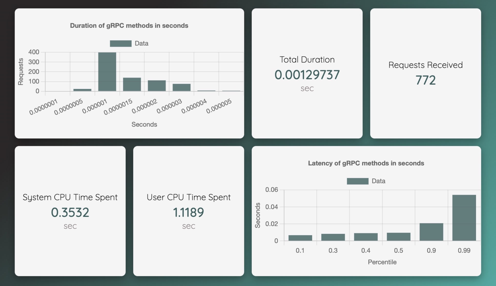
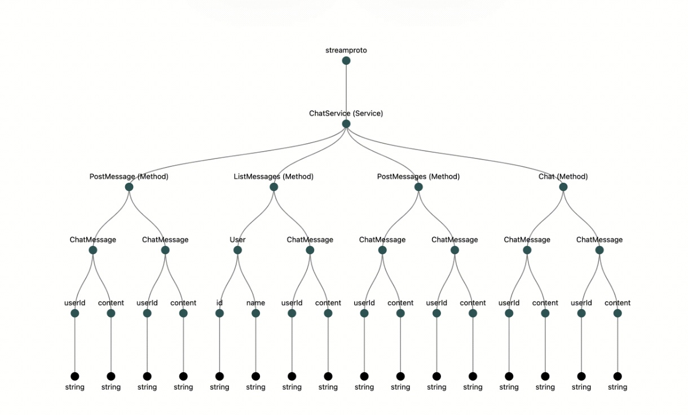

# gRPSeek
<p align="center">
  
</p>

***gRPSeek*** is a load testing and metrics visualization tool. By utilizing this package, developers can increase observability of their gRPC servers and gain valuable insights into the performance of the services.

Check out our [website](https://www.grpseek.io/)!


## Getting Started 
To get started with the package, ensure you have Node.js and npm installed on your system. Additionally, make sure you have a gRPC server set up and running. Follow these steps to use the package:
```
npm install grpseek
```
The npm package [gRPSeek](https://www.npmjs.com/package/grpseek) the gRPSeek team created, provides load testing for gRPC developers in Node.js. The way this package works under the hood is that it utilizes the worker thread module. Unlike child processes or clusters, worker threads can share memory by transferring ArrayBuffer instances or sharing the SharedArrayBuffer instances.

The most important function in this npm package is loadTest. All you have to do is pass in three arguments:

1. `filepath` — The relative filepath to the gRPC client making the calls.
2. `vu` — Number of virtual users.
3. `seconds` — Number of seconds these concurrent requests will run.
```javascript
const timer = require('grpseek')
const workerScriptPath = './greeter_client.js';
timer(workerScriptPath, 400, 15)
```
In this example, 400 worker threads are running the `greeter_client.js` file, for the duration of 15 seconds.

<p align="center">
  
</p>

This makes it extremely easy for developers in Node.js to load test their gRPC services without making massive changes to their code base or installing unnecessary dependencies. Worker threads are a native module to Node and does not require any other packages for the workers to run the client’s file.

## Protocol Buffers
Protocol Buffers (ProtoBuf) are a binary serialization format created by Google in 2008, offering a compact and efficient alternative to JSON and XML .proto files, or Protocol Buffer files, are the key to using Protocol Buffers. These files are used to define the structure of the data to be serialized or deserialized. They act as a contract or schema between services, ensuring consistent communication.

## The Need for a Visualizer
Understanding complex nested structures and repeated fields in .proto files can be challenging, especially for a developer who’s working with protocol buffers for the first time. gRPSeek aims to enhance the developer experience of working with Protocol Buffers and gRPC by offering an intuitive visualization tool, powered by D3.js to alleviate the challenges of working with complex, deeply nested .proto files. Our tool provides a clear view of the hierarchical structure of your .proto files in a tree-like graph. Just import your proto file, or multiple proto files, and see your schema come to life.
<p align="center">
  
</p>

## Troubleshooting and Support

If you encounter any issues or have questions, refer to the troubleshooting section in our documentation [link to troubleshooting section]. For further assistance, please reach out to our support team [contact information or link to support channels].


## Contribution and Feedback

We welcome contributions and feedback from the community. If you find any bugs, have feature requests, or want to contribute code, please follow our contribution guidelines and submit a pull request. Your feedback helps us improve the package and provide a better experience for everyone.

| Developed By       | Github          | LinkedIn        |
| :------------------: | :-------------: | :-------------: |
| Miri Son | [](https://github.com/msoncsswe) | [](https://www.linkedin.com/in/miri-son/) |
| Kenny Nguyen | [](https://github.com/kennysghub) | [](https://www.linkedin.com/in/kenknguyen/) |
| Johnny McConnell | [](https://github.com/johncamilomcconnell) | [](https://www.linkedin.com/in/john-camilo-mcconnell/) |
| Patryk Ploszaj| [](https://github.com/pploszaj) | [](https://www.linkedin.com/in/patryk-ploszaj07/) |